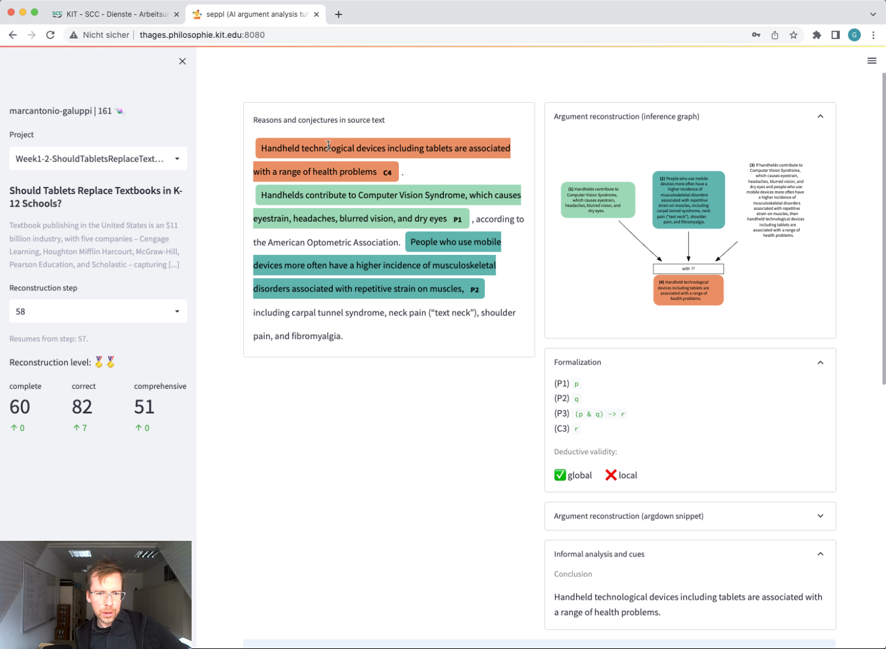
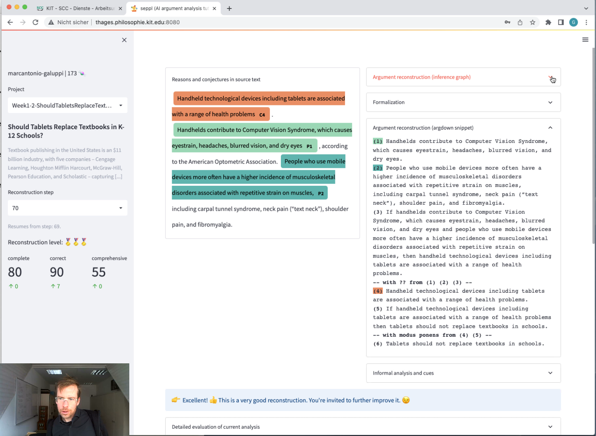

<div align="center">

</img>

# 🤹‍♂️ seppl

AI-Powered E-Learning App for Argument Analysis.

[Gallery](#gallery) •
[Highlights](#highlights) •
[Background](#background) •
[Technical Notes](#technical-notes)

</div>

> [!WARNING]
> 🤹‍♂️ **seppl** has been discontinued by [DebateLab@KIT](https://debatelab.github.io/menu/contact.html) in Feb 2023. We're providing the code in this archived repository as is and without warranty. If you have any questions or would like to pick up the project, please [contact us](https://debatelab.github.io/menu/contact.html).

## Gallery







## Highlights

⭐️ Online e-Tutor that walks students through complex argumentation analysis problems.

⭐️ Structures the reconstruction workflow into high-level stages and individual steps.

⭐️ Provides instant feedback on the correctness of each individual reconstruction step and suggests improvements.

⭐️ Works with arbitrary argumentative source texts.

⭐️ User management for weekly assignments and global learning progress.

## Background

➡️ Conceives of argument reconstruction as a hermeneutical process, in which analysts constantly revise their logical reconstruction in line with different criteria:

- Plausibility and faithfulness of premises and conclusion.
- Inferential strength (e.g., deductive correctness) of the reconstructed argument.
- Dialectic function of the reconstructed argument in its given context.

➡️ Structures the reconstruction workflow into the following _stages_:

1. **Informal analysis**: note gist, title, main conclusion
2. **Premise-conclusion structure**: state premises, conclusion, intermediate conclusions
3. **Faithfulness**: identify quotes from source text that correspond to premises and conclusion
4. **Inference graph**: informally lay out the inferential relations between argument's propositions
5. **Deductive correctness**: formalize premises and conclusion, check deductive validity

➡️ Current _stage_ of the reconstruction process is determined by automatic evaluation of reconstruction given latest revision, so users may "fall back" and progress is non-cumulative.

➡️ Users may resume reconstruction from any previous state, allowing for branching and non-linear hermeneutical processes. 

➡️ Based on the [DeepA2 framework](https://debatelab.github.io/journal/deepa2.html) and custom T5 models fine-tuned on critical thinking datasets.

➡️ Software architecture: Uses decomposed prompting with various generative and loss LLM calls, organized as [chain of responsibility](https://refactoring.guru/design-patterns/chain-of-responsibility).

➡️ Built in the summer 2022.

➡️ Deployed in winter term 2022/23 in critical thinking course at the [Karlsruhe Institute of Technology](https://www.philosophie.kit.edu/).

➡️ Evaluated with a Teaching Analysis Poll (TAP) by the Methods Lab at the House of Competence (www.hoc.kit.edu) in collaboration with KIT's quality management services (https://www.sts.kit.edu/qualitaetsmanagement.php). 🙏

➡️ Further reading:

- HKU's great Critical Thinking Web: https://philosophy.hku.hk/think/
- Gregor's textbook (de): https://argumentationsanalyse.online/
- Feldman, R. (2013). Reason and Argument: Pearson New International Edition. Pearson Higher Ed.
- Bowell, T., Cowan, R., & Kemp, G. (2019). Critical Thinking: A Concise Guide.


## Technical Notes

### Docker

```sh
# build image (optional)
docker build -t seppl:latest .

# run app
docker run -ti --rm --expose 8080 --network host seppl:latest
```

Access docker via bash:

```sh
docker run -ti --rm seppl:latest bash
```


### Prover9

There are issues with installing prover9.

> In compiling with gcc 7.4.0, we get error:
> 
> gcc  -O -Wall -lm -o prover9 prover9.o index_lits.o forward_subsume.o demodulate.o pred_elim.o unfold.o semantics.o giv_select.o white_black.o actions.o search.o utilities.o provers.o foffer.o ../ladr/libladr.a
> search.o: In function `search':
> search.c:(.text+0x6654): undefined reference to `round'
> 
> This is because the make directive is not of the correct (or new) format:
> 
> prover9: prover9.o $(OBJECTS)
> 	$(CC) $(CFLAGS) -lm -o prover9 prover9.o $(OBJECTS) ../ladr/libladr.a
> 
> It should be:
> 
> prover9: prover9.o $(OBJECTS)
> 	$(CC) $(CFLAGS) -o prover9 prover9.o $(OBJECTS) ../ladr/libladr.a -lm
> 
> There are also unused variables such as:
> mindex.c:650:11: warning: variable ‘tr’ set but not used [-Wunused-but-set-variable]
>      Trail tr;
> 
> These defects can be fixed easily.